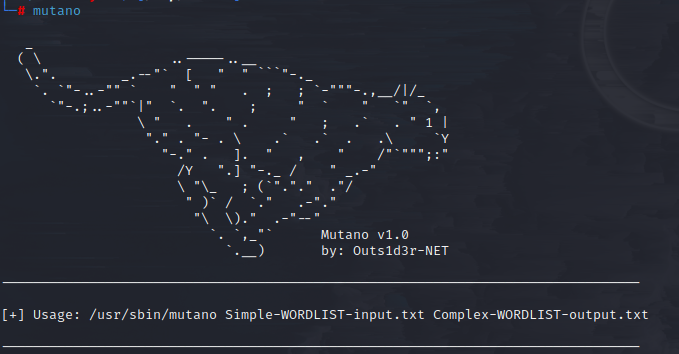
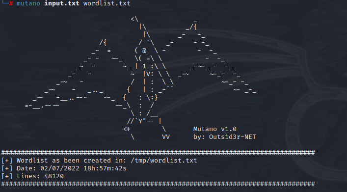

# Mutano  
> For generate wordlist with permutation  
[]()  
### Dependencies:  
```
DC@Titans:~# apt install python3 python3-pip -y
```
# 
### Installation:  
```
DC@Titans:~# git clone https://github.com/Outs1d3r-Net/Mutano.git 
DC@Titans:~# cd Mutano && bash install.sh
```
# 
### Usage:  
#####  Generate wordlist from simple file:  
```
DC@Titans:~# cd /tmp
DC@Titans:~# echo "password" > input.txt
DC@Titans:~# mutano input.txt wordlist.txt
```
[]()  
#
